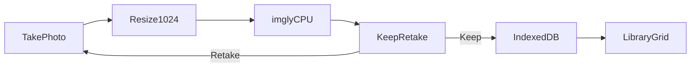

# Pastely 30-minute PWA

The 30-minute slice. Full product spec is [PRD.md](PRD.md). This is the grilled demo, not the whole PRD.

## Locked decisions

- **Host:** Vite static app on Vercel. No API, no serverless, no database.
- **Camera:** native sheet via `<input type="file" accept="image/*" capture="environment">`, plus Choose from photos (same input type, no `capture`).
- **Cutout:** `@imgly/background-removal` in the browser. Resize to 1024px long edge first. `device: 'cpu'`, `model: 'isnet_quint8'` (~40MB). Photos never upload.
- **Preview:** off-white card, light CSS drop shadow, **Keep / Retake**. No checkerboard, no 3D motion.
- **Library:** IndexedDB (`idb-keyval`), grid, newest first. No share, delete, or detail.
- **Install:** `manifest.webmanifest` + Apple meta so Safari → Add to Home Screen is standalone. Dismissible one-liner if still in Safari.
- **Out:** live `getUserMedia`, service worker, COOP/COEP headers (they hang iOS), cloud cutout.

First open needs network: imgly fetches WASM + ONNX from IMG.LY’s CDN, then the browser caches them. If iPhone Safari kills the tab, same Vercel URL on desktop — not a cloud API.

`@imgly/background-removal` is AGPL. Fine for a hackathon; not silent if this becomes a product.

## Flow



## Files to add

Scaffold with `npm create vite@latest . -- --template vanilla` in the repo root (keep existing `.gitignore` / docs).

- `index.html` — two screens (`#camera`, `#library`), hidden file inputs, preview overlay, A2HS banner, Apple/PWA meta
- `src/main.js` — tab switch, capture handlers, processing state
- `src/cutout.js` — resize canvas + lazy `import('@imgly/background-removal')`
- `src/library.js` — `idb-keyval` get/set of PNG blobs + ids
- `src/style.css` — phone-first, off-white preview/grid, shutter as primary control
- `public/manifest.webmanifest` — `display: standalone`, `start_url: "/"`, theme color
- `public/icon.svg` (and a 180px PNG for `apple-touch-icon` if easy)
- `vite.config.js` — `optimizeDeps.exclude: ['@imgly/background-removal']`. Do not set `Cross-Origin-Opener-Policy` / `Cross-Origin-Embedder-Policy`
- `package.json` — scripts `dev` / `build` / `preview`
- `vercel.json` — static `dist` only, no rewrites beyond SPA fallback if needed

Dependencies: `@imgly/background-removal`, `onnxruntime-web@1.21.0` (match the package peer), `idb-keyval`, `vite`.

## Cutout (the only hard part)

```js
// resize File/Blob to max 1024 long edge, JPEG/PNG blob out
removeBackground(smallBlob, {
  device: "cpu",
  model: "isnet_quint8",
  output: { format: "image/png", type: "foreground" },
  progress: (key, current, total) => {
    /* update "Cutting out sticker..." */
  },
});
```

Lazy-import imgly on first capture so the landing screen is instant. On failure: plain message + Retake / Choose from photos.

## UI

- Bottom or top tabs: **Take photo** | **Library**
- Camera: one shutter (“Take a picture of a sticker”), secondary “Choose from photos”
- Processing: “Cutting out sticker...”
- Preview: sticker centered on `#f5f5f3`-style ground, `filter: drop-shadow(...)`, Keep / Retake
- Library: CSS grid of stickers on the same off-white. Empty: “Take a picture of a sticker”
- A2HS: if iOS and `navigator.standalone !== true`, show once: Share → Add to Home Screen

## Deploy

`vercel` with framework Vite / output `dist`. Confirm on a phone: open the HTTPS URL in Safari, shoot a sticker, Keep, switch to Library, reload — sticker still there. Then Add to Home Screen and confirm standalone.

## Build checklist

- [ ] Vite vanilla scaffold, package.json, vite.config (exclude imgly), vercel.json
- [ ] Manifest, Apple meta, icons, A2HS one-liner, two-tab phone layout
- [ ] Resize to 1024px then imgly CPU/quint8; processing + failure copy
- [ ] Camera/gallery inputs, off-white Keep/Retake preview, IndexedDB library grid
- [ ] Build, run locally, check camera-to-grid loop before Vercel

## Do not touch

[PRD.md](PRD.md) stays as the full product spec. This build is the 30-minute slice. No share/delete, no live camera, no backend.
